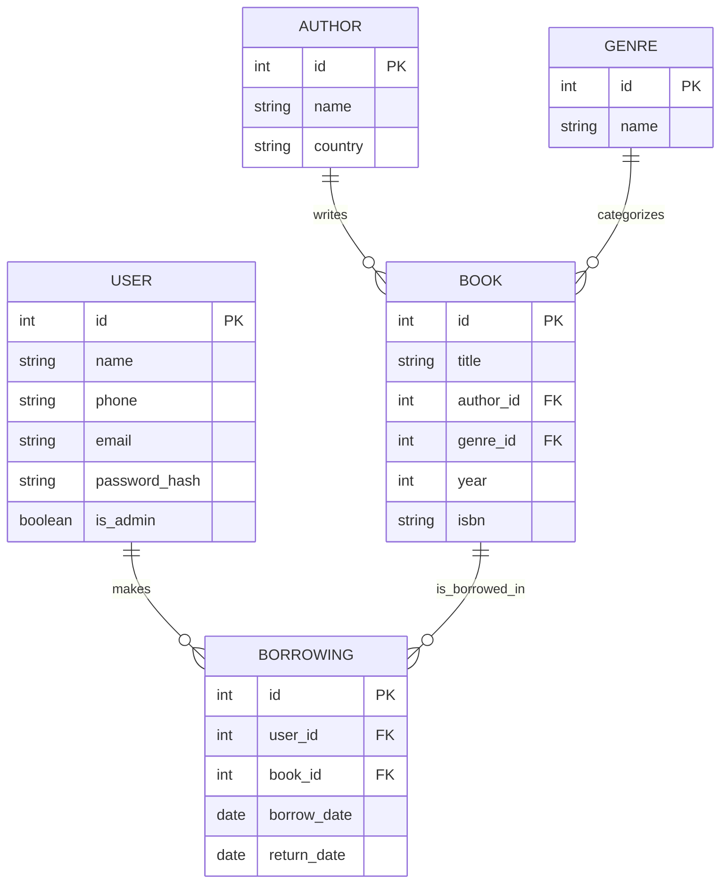

# Library Management System - Draft ERD

```mermaid
erDiagram
    USER ||--o{ BORROWING : makes
    BOOK ||--o{ BORROWING : is_borrowed_in
    AUTHOR ||--o{ BOOK : writes
    GENRE ||--o{ BOOK : categorizes

    USER {
      int id PK
      string name
      string phone
      string email
      string password_hash
      boolean is_admin
    }

    AUTHOR {
      int id PK
      string name
      string country
    }

    GENRE {
      int id PK
      string name
    }

    BOOK {
      int id PK
      string title
      int author_id FK
      int genre_id FK
      int year
      string isbn
    }

    BORROWING {
      int id PK
      int user_id FK
      int book_id FK
      date borrow_date
      date return_date
    }
```

Notes: This mirrors the provided sketch. Later we can extend with copies/inventory and fines.
